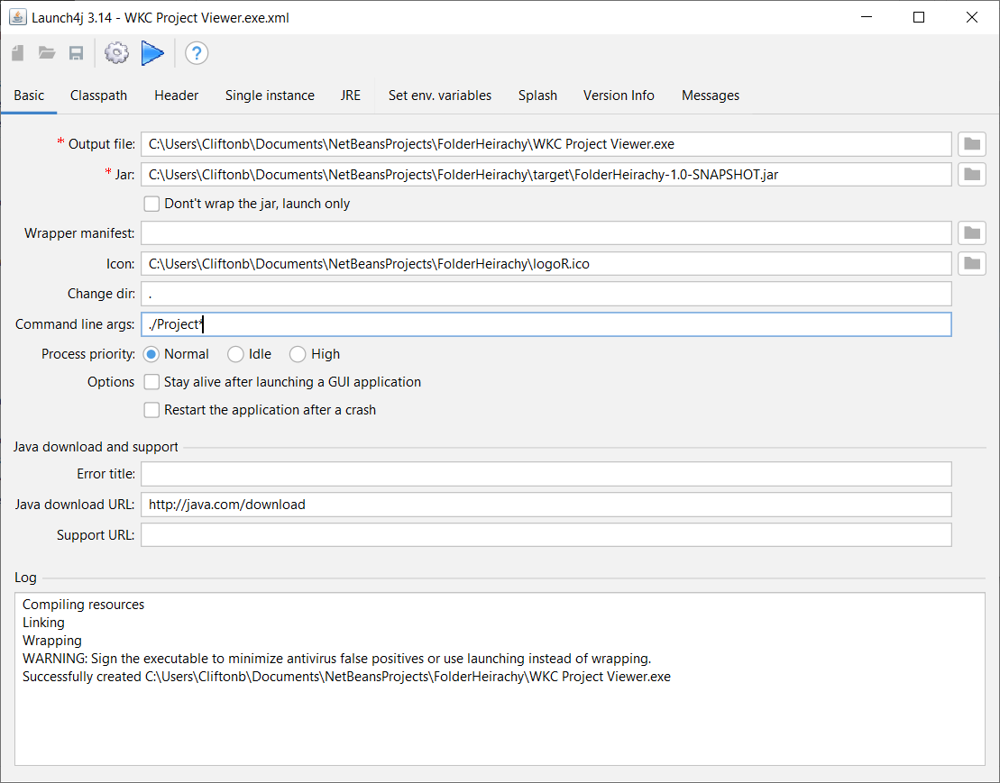

## Table of contents
* [General info](#general-info)
* [Technologies](#technologies)
* [Creating an exe](#creating-an-exe)

## General info
This project is simple Lorem ipsum dolor generator.
	
## Technologies
Project is created with:
* Java: 15.0.1
* Netbeans 12.2
* Java compiler: 15.0.1
* Launch4j: 2.1.1
	
## Creating an exe
* Make sure you have all the tools above installed.
* Download the source code and add it to Netbeans as a Netbeans project (I recommend cloning it with GitHub).
* Right click on the project in NetBeans and select 'Clean and Build'. This creates a .jar of the project in the FolderHeirachy/target directory.
* The above .jar needs to be run with the directory as an argument. You can run it in the terminal as follows.

```
$ cd [jar directory]
$ java -jar FolderHeirachy-1.0-SNAPSHOT.jar C:\Users\Cliftonb\Downloads
```

* The launch4j combines with .jar file with a specified argument into a single .exe file. Note the settings below. Mainly the argument, ./Project* means the folder that starts with "Project" in the current directory of the exe.


